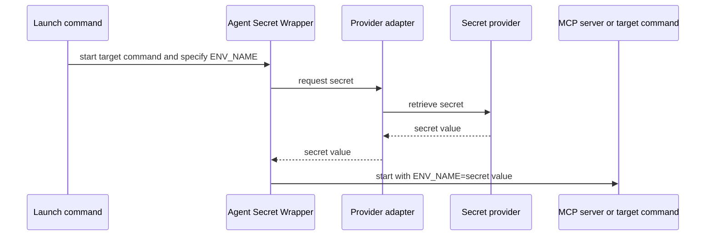

# Agent Secret Wrapper

Headless local secret adapters for launching MCP servers, coding tools, and scripts.

## Problem it solves

MCP configuration, Compose files, and shell startup scripts often need an API token. This CLI keeps configuration free of the secret itself and retrieves it only when the target command starts.

## How it works



## Candidate build

This is an unpublished candidate for local testing. It cannot be accidentally published to npm.

```sh
npm test
node ./bin/agent-secret-wrapper.mjs --help
```

After publication, the same command will be available through:

```sh
npx @trocho/agent-secret-wrapper run --help
```

## Use

Every provider has the same runtime API. `--env` is both the logical secret name and the environment variable passed to the target command. Replace the target with the MCP server, tool, or script you want to start.

```sh
agent-secret-wrapper run \
  --provider PROVIDER --env ENV_NAME \
  -- TARGET [ARGS...]
```

Provider-specific identifiers are not passed to `run`. When a default naming convention does not fit, bind `ENV_NAME` to the provider once in [provider configuration](docs/provider-configuration.md). The binding contains only identifiers, never secret values.

## Install the skill

Install for Codex and Claude Code with [skills.sh](https://skills.sh/):

```sh
npx skills add git@github.com:trocho/agent-secret-wrapper.git --skill secret-process-wrapper --agent codex claude-code --global
```

The repository is private for now, so the installer needs SSH access to `trocho/agent-secret-wrapper`.

## Install the Claude Code plugin

```text
/plugin marketplace add git@github.com:trocho/agent-secret-wrapper.git
/plugin install secret-process-wrapper@patryk-agent-tools
```

## Providers

| Provider | Value for `--provider` | Run example | Status |
| --- | --- | --- | --- |
| macOS Keychain | `macos-keychain` | `--provider macos-keychain --env EXAMPLE_API_KEY` | ✅ Supported |
| Linux Secret Service | `linux-secret-service` | `--provider linux-secret-service --env EXAMPLE_API_KEY` | ✅ Supported |
| Windows Credential Manager | `windows-credential-manager` | `--provider windows-credential-manager --env EXAMPLE_API_KEY` | ✅ Supported |
| Bitwarden | `bitwarden` | `--provider bitwarden --env EXAMPLE_API_KEY` | ✅ Supported |
| Bitwarden Secrets Manager | `bws` | `--provider bws --env EXAMPLE_API_KEY` | ✅ Supported |
| 1Password | `1password` | `--provider 1password --env EXAMPLE_API_KEY` | ✅ Supported |
| Infisical | `infisical` | `--provider infisical --env EXAMPLE_API_KEY` | ✅ Supported |

For example, each provider starts the target in the same way:

```sh
agent-secret-wrapper run --provider bws --env EXAMPLE_API_KEY -- /absolute/path/to/example-mcp
```

## Development

```sh
npm test
npm run validate
npm run pack:check
```

Release tags build candidate artifacts for GitHub Releases. npm publication is intentionally not configured until dogfooding is complete.
