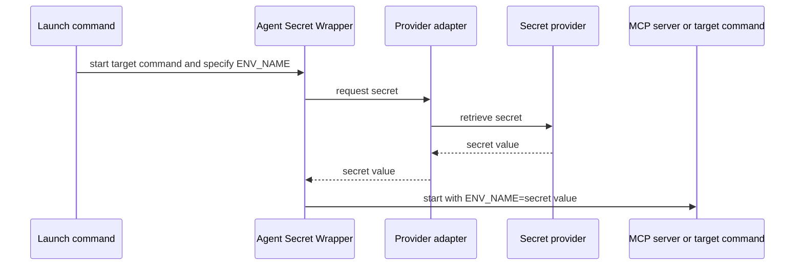

# Agent Secret Wrapper

Headless local secret adapters for launching MCP servers, coding tools, and scripts.

## Problem it solves

MCP configuration, Compose files, and shell startup scripts often need an API token. This CLI keeps configuration free of the secret itself and retrieves it only when the target command starts.

## How it works



## Candidate build

This is an unpublished candidate for local testing. It cannot be accidentally published to npm.

```sh
npm test
node ./bin/agent-secret-wrapper.mjs --help
```

After publication, the same command will be available through:

```sh
npx @trocho/agent-secret-wrapper run --help
```

## Use

Use a provider reference, never the secret value itself. Replace the example target command with the MCP server, tool, or script you want to start.

```sh
agent-secret-wrapper run \
  --provider PROVIDER --env ENV_NAME \
  [provider reference] \
  -- TARGET [ARGS...]
```

## Install the skill

Install for Codex and Claude Code with [skills.sh](https://skills.sh/):

```sh
npx skills add git@github.com:trocho/agent-secret-wrapper.git --skill secret-process-wrapper --agent codex claude-code --global
```

The repository is private for now, so the installer needs SSH access to `trocho/agent-secret-wrapper`.

## Install the Claude Code plugin

```text
/plugin marketplace add git@github.com:trocho/agent-secret-wrapper.git
/plugin install secret-process-wrapper@patryk-agent-tools
```

## Providers

| Provider | Value for `--provider` | Reference to provide | Status |
| --- | --- | --- | --- |
| macOS Keychain | `macos-keychain` | `--service SERVICE --account ACCOUNT` | ✅ Supported |
| Linux Secret Service | `linux-secret-service` | `--service SERVICE --account ACCOUNT` | ✅ Supported |
| Windows Credential Manager | `windows-credential-manager` | `--target TARGET` | ✅ Supported |
| Bitwarden | `bitwarden` | `--item ITEM` | ✅ Supported |
| Bitwarden Secrets Manager | `bws` | `--secret-id SECRET_ID` | ✅ Supported |
| 1Password | `1password` | `--reference op://VAULT/ITEM/FIELD` | ✅ Supported |
| Infisical | `infisical` | `--secret-key KEY` | ✅ Supported |

### macOS Keychain

```sh
agent-secret-wrapper run \
  --provider macos-keychain \
  --service example-mcp --account api-key \
  --env EXAMPLE_API_KEY \
  -- /absolute/path/to/example-mcp
```

### Linux Secret Service

```sh
agent-secret-wrapper run \
  --provider linux-secret-service \
  --service example-mcp --account api-key \
  --env EXAMPLE_API_KEY \
  -- /absolute/path/to/example-mcp
```

### Windows Credential Manager

```powershell
agent-secret-wrapper run `
  --provider windows-credential-manager `
  --target example-mcp-api-key `
  --env EXAMPLE_API_KEY `
  -- C:\\tools\\example-mcp.exe
```

### Bitwarden

```sh
agent-secret-wrapper run \
  --provider bitwarden \
  --item example-mcp-api-key \
  --env EXAMPLE_API_KEY \
  -- /absolute/path/to/example-mcp
```

### Bitwarden Secrets Manager

```sh
agent-secret-wrapper run \
  --provider bws \
  --secret-id SECRET_ID \
  --env EXAMPLE_API_KEY \
  -- /absolute/path/to/example-mcp
```

### 1Password

```sh
agent-secret-wrapper run \
  --provider 1password \
  --reference 'op://Development/example-mcp/api-key' \
  --env EXAMPLE_API_KEY \
  -- /absolute/path/to/example-mcp
```

### Infisical

```sh
agent-secret-wrapper run \
  --provider infisical \
  --secret-key EXAMPLE_API_KEY \
  --project-id PROJECT_ID --environment dev --path / \
  --env EXAMPLE_API_KEY \
  -- /absolute/path/to/example-mcp
```

## Development

```sh
npm test
npm run validate
npm run pack:check
```

Release tags build candidate artifacts for GitHub Releases. npm publication is intentionally not configured until dogfooding is complete.
