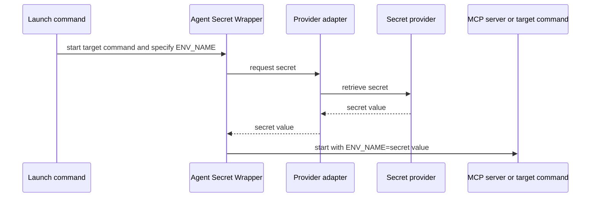

# Agent Secret Wrapper

Headless local secret adapters for launching MCP servers, coding tools, and scripts.

## Problem it solves

MCP configuration, Compose files, and shell startup scripts often need an API token. This CLI keeps configuration free of the secret itself and retrieves it only when the target command starts.

## How it works



## Candidate build

This is an unpublished candidate for local testing. It cannot be accidentally published to npm.

```sh
npm test
node ./bin/agent-secret-wrapper.mjs --help
```

After publication, the same command will be available through:

```sh
npx @trocho/agent-secret-wrapper run --help
```

## Quick start

Use the same command shape for every provider. This example reads the `password` value from the Bitwarden item named `portainer` and exposes it only to the MCP process as `PORTAINER_API_KEY`.

```sh
agent-secret-wrapper run \
  --provider bitwarden \
  --selector portainer.password \
  --env PORTAINER_API_KEY \
  -- /absolute/path/to/portainer-mcp
```

Replace only the provider location and the target command. Never put the secret value into the command or shell history.

## Command model

| Argument | Meaning |
| --- | --- |
| `--provider` | Which secret system to query. |
| `--selector` | A dot-separated path: first the record or target, then its value, then optional JSON properties. |
| `--scope` | Optional context, such as a vault, project, environment, or path. Repeat when needed. |
| `--decode` | Optional explicit decoding of the selected value. Currently `base64` is supported. |
| `--env` | The environment-variable name supplied to the target process. |

The canonical form is:

```sh
agent-secret-wrapper run \
  --provider PROVIDER \
  --selector SELECTOR [--scope NAME=VALUE ...] [--decode base64] \
  --env ENV_NAME \
  -- TARGET [ARGS...]
```

## Install the skill

Install for Codex and Claude Code with [skills.sh](https://skills.sh/):

```sh
npx skills add https://github.com/trocho/agent-secret-wrapper.git --skill secret-process-wrapper --agent codex claude-code --global
```

The repository is public, so the installer can download the skill directly from GitHub.

The skill tells Codex and Claude Code to use this consistent, secret-safe command pattern instead of inventing provider-specific launch scripts or placing secrets in configuration.

## Install the Claude Code plugin

```text
/plugin marketplace add git@github.com:trocho/agent-secret-wrapper.git
/plugin install secret-process-wrapper@agent-secret-wrapper
```

## Selectors and providers

A selector identifies exactly one value without a separate item/field vocabulary. Its first segment is the provider's record locator; the second is the value within that record where the provider has one. Further segments select a scalar inside a JSON value. Escape a literal dot in any segment with `\.` and quote that selector so the shell preserves the backslash.

| Provider | Value for `--provider` | Selector structure | Example |
| --- | --- | --- | --- |
| macOS Keychain | `macos-keychain` | `SERVICE.ACCOUNT[.JSON_PATH]` | `portainer-mcp.api-key` |
| Linux Secret Service | `linux-secret-service` | `SERVICE.ACCOUNT[.JSON_PATH]` | `portainer-mcp.api-key` |
| Windows Credential Manager | `windows-credential-manager` | `TARGET[.JSON_PATH]` | `portainer-mcp-api-key` |
| Bitwarden | `bitwarden` | `ITEM.FIELD[.JSON_PATH]` | `portainer.password` |
| Bitwarden Secrets Manager | `bws` | `SECRET_ID[.value][.JSON_PATH]` | `SECRET_ID.value` |
| 1Password | `1password` | `ITEM.FIELD[.JSON_PATH]`; add `--scope vault=VAULT` | `portainer.api-key` |
| Infisical | `infisical` | `SECRET_KEY[.value][.JSON_PATH]` | `PORTAINER_API_KEY.value` |

For example, `portainer.config.api.token` first selects the `config` field of the `portainer` item, parses that field as JSON, then passes its `api.token` value to the target process. JSON properties may also name array indexes, such as `credentials.0.token`. The final selection must be text, a number, or a boolean.

If the selected text is Base64-encoded, opt in to decoding it:

```sh
agent-secret-wrapper run \
  --provider bitwarden --selector portainer.encoded-api-key \
  --decode base64 --env PORTAINER_API_KEY \
  -- /absolute/path/to/portainer-mcp
```

The wrapper never guesses that a value is Base64. It decodes only when asked and rejects malformed values.

For a locator with literal dots, use single quotes so the shell passes the selector unchanged:

```sh
--selector 'com\.example\.portainer.api-key'
```

The same escaping applies to a Bitwarden login property: `--selector 'portainer.login\.username'`.

See the skill's [provider recipes](skills/secret-process-wrapper/references/provider-recipes.md) for a copy-ready command for every provider.

## Debugging

Add `--debug` before `--` to see the selected provider, selector, decoding mode, scope, retrieval stage, and target-process exit code on standard error.

```sh
agent-secret-wrapper run \
  --provider bitwarden --selector portainer.password \
  --env PORTAINER_API_KEY --debug \
  -- /absolute/path/to/portainer-mcp
```

Debug output never includes the secret value, provider authentication, command arguments, or provider response.

## Development

```sh
npm test
npm run validate
npm run pack:check
```

Release tags build candidate artifacts for GitHub Releases. npm publication is intentionally not configured until dogfooding is complete.
