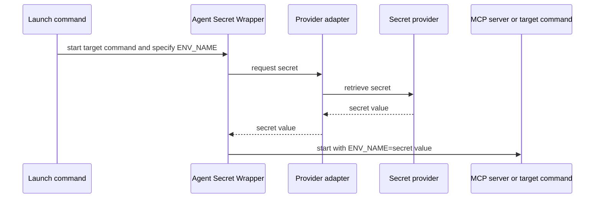

# Agent Secret Wrapper

Headless local secret adapters for launching MCP servers, coding tools, and scripts.

## Problem it solves

MCP configuration, Compose files, and shell startup scripts often need an API token. This CLI keeps configuration free of the secret itself and retrieves it only when the target command starts.

## How it works



## Candidate build

This is an unpublished candidate for local testing. It cannot be accidentally published to npm.

```sh
npm test
node ./bin/agent-secret-wrapper.mjs --help
```

After publication, the same command will be available through:

```sh
npx @trocho/agent-secret-wrapper run --help
```

## Use

```sh
agent-secret-wrapper run \
  --provider macos-keychain \
  --service codex-example-mcp-token --account api-key \
  --env EXAMPLE_API_KEY \
  -- /absolute/path/to/example-mcp
```

## Install the skill

Install for Codex and Claude Code with [skills.sh](https://skills.sh/):

```sh
npx skills add git@github.com:trocho/agent-secret-wrapper.git --skill secret-process-wrapper --agent codex claude-code --global
```

The repository is private for now, so the installer needs SSH access to `trocho/agent-secret-wrapper`.

## Install the Claude Code plugin

```text
/plugin marketplace add git@github.com:trocho/agent-secret-wrapper.git
/plugin install secret-process-wrapper@patryk-agent-tools
```

## Providers

| Provider | Status |
| --- | --- |
| macOS Keychain | ✅ Supported |
| Linux Secret Service | ✅ Supported |
| Windows Credential Manager | ✅ Supported |
| Bitwarden | ✅ Supported |
| Bitwarden Secrets Manager | ✅ Supported |
| 1Password | ✅ Supported |
| Infisical | ✅ Supported |

## Development

```sh
npm test
npm run validate
npm run pack:check
```

Release tags build candidate artifacts for GitHub Releases. npm publication is intentionally not configured until dogfooding is complete.
