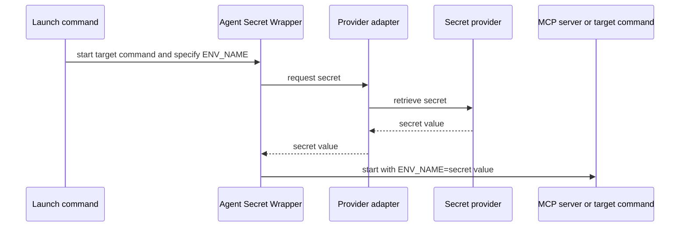

# Agent Secret Wrapper

Headless local secret adapters for launching MCP servers, coding tools, and scripts.

## Problem it solves

MCP configuration, Compose files, and shell startup scripts often need an API token. This CLI keeps configuration free of the secret itself and retrieves it only when the target command starts.

## How it works



## Candidate build

This is an unpublished candidate for local testing. It cannot be accidentally published to npm.

```sh
npm test
node ./bin/agent-secret-wrapper.mjs --help
```

After publication, the same command will be available through:

```sh
npx @trocho/agent-secret-wrapper run --help
```

## Quick start

Use the same command shape for every provider. This example reads the `password` field from the Bitwarden item named `portainer` and exposes it only to the MCP process as `PORTAINER_API_KEY`.

```sh
agent-secret-wrapper run \
  --provider bitwarden \
  --item portainer --field password \
  --env PORTAINER_API_KEY \
  -- /absolute/path/to/portainer-mcp
```

Replace only the provider location and the target command. Never put the secret value into the command or shell history.

## Command model

| Argument | Meaning |
| --- | --- |
| `--provider` | Which secret system to query. |
| `--item` | The record, entry, or secret to read. |
| `--field` | A value inside that record; omit it when the provider has a single value. |
| `--scope` | Optional context, such as a vault, project, environment, or path. Repeat when needed. |
| `--env` | The environment-variable name supplied to the target process. |

The canonical form is:

```sh
agent-secret-wrapper run \
  --provider PROVIDER \
  --item ITEM [--field FIELD] [--scope NAME=VALUE ...] \
  --env ENV_NAME \
  -- TARGET [ARGS...]
```

## Install the skill

Install for Codex and Claude Code with [skills.sh](https://skills.sh/):

```sh
npx skills add git@github.com:trocho/agent-secret-wrapper.git --skill secret-process-wrapper --agent codex claude-code --global
```

The repository is private for now, so the installer needs SSH access to `trocho/agent-secret-wrapper`.

The skill tells Codex and Claude Code to use this consistent, secret-safe command pattern instead of inventing provider-specific launch scripts or placing secrets in configuration.

## Install the Claude Code plugin

```text
/plugin marketplace add git@github.com:trocho/agent-secret-wrapper.git
/plugin install secret-process-wrapper@patryk-agent-tools
```

## Providers

| Provider | Value for `--provider` | `--item` means | `--field` means |
| --- | --- | --- | --- |
| macOS Keychain | `macos-keychain` | Service | Account |
| Linux Secret Service | `linux-secret-service` | Service | Account |
| Windows Credential Manager | `windows-credential-manager` | Target | Not used |
| Bitwarden | `bitwarden` | Vault item | `password`, `username`, `totp`, `uri`, or a custom field |
| Bitwarden Secrets Manager | `bws` | Secret ID | `value` only |
| 1Password | `1password` | Item | Item field; add `--scope vault=VAULT` |
| Infisical | `infisical` | Secret key | `value` only; add scope when required |

See [provider recipes](docs/provider-recipes.md) for a copy-ready command for every provider.

## Debugging

Add `--debug` before `--` to see the selected provider, item, field, scope, retrieval stage, and target-process exit code on standard error.

```sh
agent-secret-wrapper run \
  --provider bitwarden --item portainer --field password \
  --env PORTAINER_API_KEY --debug \
  -- /absolute/path/to/portainer-mcp
```

Debug output never includes the secret value, provider authentication, command arguments, or provider response.

## Development

```sh
npm test
npm run validate
npm run pack:check
```

Release tags build candidate artifacts for GitHub Releases. npm publication is intentionally not configured until dogfooding is complete.
