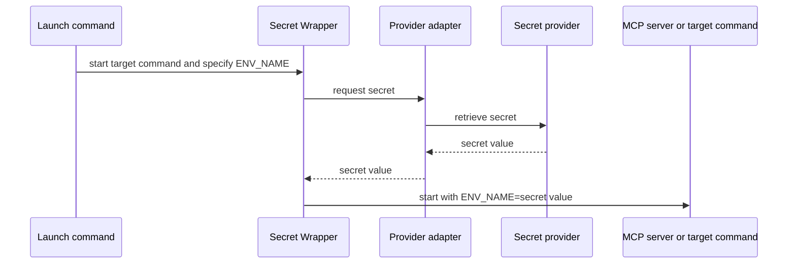

# Secret Wrapper

Headless local secret adapters for launching MCP servers, coding tools, and scripts.

## Problem it solves

MCP configuration, Compose files, and shell startup scripts often need an API token. This CLI keeps configuration free of the secret itself and retrieves it only when the target command starts.

## How it works



## Candidate build

This is an unpublished candidate for local testing. It cannot be accidentally published to npm.

```sh
npm test
node ./bin/secret-wrapper.mjs --help
```

After publication, the same command will be available through:

```sh
npx @trocho/secret-wrapper run --help
```

## Quick start

Use the same command shape for every provider. This example reads the `password` value from the Bitwarden item named `portainer` and exposes it only to the MCP process as `PORTAINER_API_KEY`.

```sh
secret-wrapper run \
  --provider bitwarden \
  --bind PORTAINER_API_KEY=portainer.password \
  -- /absolute/path/to/portainer-mcp
```

Replace only the provider location and the target command. Never put the secret value into the command or shell history.

## Command model

| Argument | Meaning |
| --- | --- |
| `--provider` | Which secret system to query. |
| `--bind` | Repeatable `ENV_NAME=SELECTOR` pair: the target variable and its provider location. |
| `--scope` | Optional context, such as a vault, project, environment, or path. Repeat when needed. |
| `--decode-record` | Repeatable `ENV_NAME=base64`: decode the provider's complete value before following its JSON path. |
| `--decode` | Repeatable `ENV_NAME=base64`: decode the final value after following its JSON path. |

The canonical form is:

```sh
secret-wrapper run \
  --provider PROVIDER \
  --bind ENV_NAME=SELECTOR [--bind ENV_NAME=SELECTOR ...] \
  [--scope NAME=VALUE ...] [--decode-record ENV_NAME=base64 ...] [--decode ENV_NAME=base64 ...] \
  -- TARGET [ARGS...]
```

## Install the skill

Install for Codex and Claude Code with [skills.sh](https://skills.sh/):

```sh
npx skills add https://github.com/trocho/secret-wrapper.git --skill secret-wrapper --agent codex claude-code --global
```

The repository is public, so the installer can download the skill directly from GitHub.

The skill tells Codex and Claude Code to use this consistent, secret-safe command pattern instead of inventing provider-specific launch scripts or placing secrets in configuration.

## Install the Claude Code plugin

```text
/plugin marketplace add https://github.com/trocho/secret-wrapper.git
/plugin install secret-wrapper@secret-wrapper
```

## Selectors and providers

A selector is the right side of a bind: `ENV_NAME=SELECTOR`. It identifies one value without a separate item/field vocabulary. Its first segment is the provider's record locator; the second is the value within that record where the provider has one. Further segments select a scalar inside a JSON value. Escape a literal dot in any segment with `\.` and quote the whole bind so the shell preserves the backslash.

| Provider | Value for `--provider` | Selector structure | Example |
| --- | --- | --- | --- |
| macOS Keychain | `macos-keychain` | `SERVICE.ACCOUNT[.JSON_PATH]` | `portainer-mcp.api-key` |
| Linux Secret Service | `linux-secret-service` | `SERVICE.ACCOUNT[.JSON_PATH]` | `portainer-mcp.api-key` |
| Windows Credential Manager | `windows-credential-manager` | `TARGET[.JSON_PATH]` | `portainer-mcp-api-key` |
| Bitwarden | `bitwarden` | `ITEM.FIELD[.JSON_PATH]` | `portainer.password` |
| Bitwarden Secrets Manager | `bws` | `SECRET_ID[.value][.JSON_PATH]` | `SECRET_ID.value` |
| 1Password | `1password` | `ITEM.FIELD[.JSON_PATH]`; add `--scope vault=VAULT` | `portainer.api-key` |
| Infisical | `infisical` | `SECRET_KEY[.value][.JSON_PATH]` | `PORTAINER_API_KEY.value` |

For example, `portainer.config.api.token` first selects the `config` field of the `portainer` item, parses that field as JSON, then passes its `api.token` value to the target process. JSON properties may also name array indexes, such as `credentials.0.token`. The final selection must be text, a number, or a boolean.

Use as many binds as the target needs. Every bind is resolved before the target starts, so a failed lookup does not start it with a partial environment:

```sh
secret-wrapper run \
  --provider bitwarden \
  --bind PORTAINER_API_KEY=portainer.api-key \
  --bind PORTAINER_PASSWORD=portainer.password \
  -- /absolute/path/to/portainer-mcp
```

Decoding is explicit and per bind. `--decode` applies to the final selected value; `--decode-record` applies first, before a JSON path is read. They may be combined: the following accepts a Base64-encoded JSON record whose `password` property is itself Base64-encoded.

```sh
secret-wrapper run \
  --provider bitwarden \
  --bind PORTAINER_API_KEY=portainer.config.api \
  --bind PORTAINER_PASSWORD=portainer.config.credentials.password \
  --decode-record PORTAINER_API_KEY=base64 \
  --decode-record PORTAINER_PASSWORD=base64 \
  --decode PORTAINER_PASSWORD=base64 \
  -- /absolute/path/to/portainer-mcp
```

The wrapper never guesses encoding and rejects malformed Base64 or invalid JSON.

For a locator with literal dots, use single quotes so the shell passes the selector unchanged:

```sh
--bind 'PORTAINER_API_KEY=com\.example\.portainer.api-key'
```

The same escaping applies to a Bitwarden login property: `--bind 'PORTAINER_USER=portainer.login\.username'`.

See the skill's [provider recipes](skills/secret-wrapper/references/provider-recipes.md) for a copy-ready command for every provider.

## Debugging

Add `--debug` before `--` to see the provider, bind names and selectors, decoding stages, scope, retrieval stage, and target-process exit code on standard error.

```sh
secret-wrapper run \
  --provider bitwarden --bind PORTAINER_API_KEY=portainer.password \
  --debug \
  -- /absolute/path/to/portainer-mcp
```

Debug output never includes the secret value, provider authentication, command arguments, or provider response.

## Development

```sh
npm test
npm run validate
npm run pack:check
```

Release tags build candidate artifacts for GitHub Releases. npm publication is intentionally not configured until dogfooding is complete.
