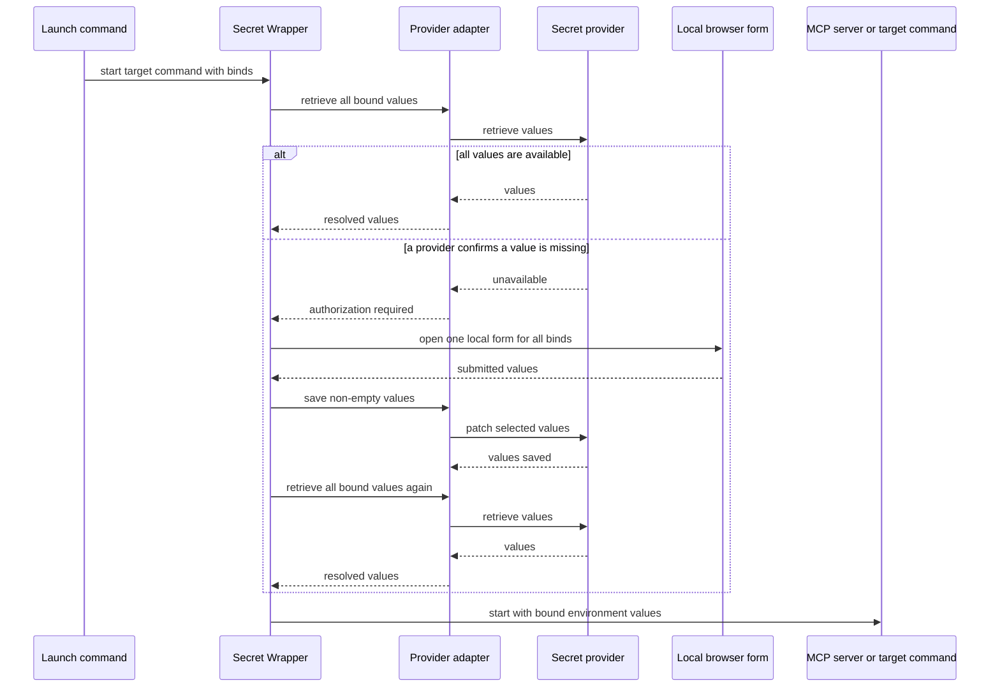

# Secret Wrapper

Headless local secret adapters for launching MCP servers, coding tools, and scripts.

## Problem it solves

MCP configuration, Compose files, and shell startup scripts often need an API token. This CLI keeps configuration free of the secret itself and retrieves it only when the target command starts.

On first use, a confirmed missing value can be collected in a one-time browser form on `127.0.0.1`, stored with the selected provider, and then used to start the target command. The secret is never put in the MCP configuration, shell history, or debug output.

## How it works



## Candidate build

This is an unpublished candidate for local testing. It cannot be accidentally published to npm.

```sh
npm test
node ./bin/secret-wrapper.mjs --help
```

After publication, the same command will be available through:

```sh
npx @trocho/secret-wrapper run --help
```

## Quick start

Use the same command shape for every provider. This example reads the `password` value from the Bitwarden item named `portainer` and exposes it only to the MCP process as `PORTAINER_API_KEY`.

```sh
secret-wrapper run \
  --provider bitwarden \
  --bind PORTAINER_API_KEY=portainer.password \
  -- /absolute/path/to/portainer-mcp
```

Replace only the provider location and the target command. Never put the secret value into the command or shell history.

## First use and changing values

`run` is the one-command path. It opens one local browser tab only when a provider confirms that a value is missing. A malformed Base64/JSON value, provider login failure, locked store, or other read error stops the command without opening a form. The tab identifies the target process, provider, and selectors; it never displays an existing secret value.

Before `run` writes a submitted value, it checks the provider again. If another process created the value while the form was open, the new value is preserved instead of overwritten. The completion page shows the result for every bind. If saving fails, the same page shows the safe provider diagnostic and allows another submission; submitted values are never echoed back.

```sh
secret-wrapper run \
  --provider macos-keychain \
  --bind PORTAINER_API_KEY=portainer-mcp.api-key \
  --bind PORTAINER_PASSWORD=portainer-mcp.password \
  -- /absolute/path/to/portainer-mcp
```

To add or replace values deliberately, run `authorize` with the same provider, binds, and optional scope. It opens the same local form but does not start a target process; unlike first-use `run`, it intentionally updates an existing selected value.

```sh
secret-wrapper authorize \
  --provider bitwarden \
  --bind PORTAINER_API_KEY=portainer.api-key \
  --bind PORTAINER_PASSWORD=portainer.password
```

Leave a form field blank to preserve its current value. When a selector points inside JSON, Secret Wrapper reads the source value, patches only the selected property or array entry, and writes the transformed source back. Other JSON values remain intact.

## Command model

| Argument | Meaning |
| --- | --- |
| `--provider` | Which secret system to query. |
| `--bind` | Repeatable `ENV_NAME=SELECTOR` pair: the target variable and its provider location. |
| `--scope` | Optional context, such as a vault, project, environment, or path. Repeat when needed. |

`--bind` deliberately rejects process-control names such as `PATH`, `NODE_OPTIONS`, and dynamic-loader variables. Use it for credentials and target settings, not for changing how the target executable starts.

The canonical form is:

```sh
secret-wrapper run \
  --provider PROVIDER \
  --bind ENV_NAME=SELECTOR [--bind ENV_NAME=SELECTOR ...] \
  [--scope NAME=VALUE ...] [--debug] \
  -- TARGET [ARGS...]
```

To change values without launching a target:

```sh
secret-wrapper authorize \
  --provider PROVIDER \
  --bind ENV_NAME=SELECTOR [--bind ENV_NAME=SELECTOR ...] \
  [--scope NAME=VALUE ...] [--debug]
```

## Install the skill

Install for Codex and Claude Code with [skills.sh](https://skills.sh/):

```sh
npx skills add https://github.com/trocho/secret-wrapper.git --skill secret-wrapper --agent codex claude-code --global
```

The repository is public, so the installer can download the skill directly from GitHub.

The skill tells Codex and Claude Code to use this consistent, secret-safe command pattern instead of inventing provider-specific launch scripts or placing secrets in configuration.

## Install the Claude Code plugin

```text
/plugin marketplace add https://github.com/trocho/secret-wrapper.git
/plugin install secret-wrapper@secret-wrapper
```

## Selectors and providers

A selector is the right side of a bind: `ENV_NAME=SELECTOR`. It identifies one value without a separate item/field vocabulary. Its first segment is the provider's record locator; the second is the value within that record where the provider has one. Transform annotations are attached directly to the value they transform: `[base64]` decodes text and `[json]` parses JSON text. Escape literal `.`, `\`, `[` and `]` as `\.`, `\\`, `\[` and `\]`, and quote the whole bind so the shell preserves the escape.

| Provider | Value for `--provider` | Browser authorization | Selector structure | Example |
| --- | --- | --- | --- | --- |
| macOS Keychain | `macos-keychain` | Yes | `SERVICE.ACCOUNT[TRANSFORMS][.JSON_PROPERTY[TRANSFORMS]...]` | `portainer-mcp.api-key[base64]` |
| Linux Secret Service | `linux-secret-service` | Yes | `SERVICE.ACCOUNT[TRANSFORMS][.JSON_PROPERTY[TRANSFORMS]...]` | `portainer-mcp.api-key[base64]` |
| Windows Credential Manager | `windows-credential-manager` | Not yet | `TARGET[TRANSFORMS][.JSON_PROPERTY[TRANSFORMS]...]` | `portainer-mcp-api-key[json].token` |
| Bitwarden | `bitwarden` | Yes | `ITEM.FIELD[TRANSFORMS][.JSON_PROPERTY[TRANSFORMS]...]` | `portainer.password[base64]` |
| Bitwarden Secrets Manager | `bws` | Not yet | `SECRET_ID[.value][TRANSFORMS][.JSON_PROPERTY[TRANSFORMS]...]` | `SECRET_ID.value[base64]` |
| 1Password | `1password` | Not yet | `ITEM.FIELD[TRANSFORMS][.JSON_PROPERTY[TRANSFORMS]...]`; add `--scope vault=VAULT` | `portainer.api-key[base64]` |
| Infisical | `infisical` | Not yet | `SECRET_KEY[.value][TRANSFORMS][.JSON_PROPERTY[TRANSFORMS]...]` | `PORTAINER_API_KEY.value[base64]` |

`[json]` is required before JSON properties. For example, `portainer.config[json].api.token` selects the `config` field of the `portainer` item, parses it as JSON, then passes its `api.token` value to the target process. JSON properties may also name array indexes, such as `credentials.0.token`. The final selection must be text, a number, or a boolean.

Bitwarden and 1Password may omit `FIELD`; it then means their default `password` field, so `portainer[base64]` is valid. Prefer the explicit `portainer.password[base64]` form in shared configuration. An annotation cannot appear before another required provider locator, so `service[base64].account` is invalid.

Use as many binds as the target needs. Every bind is resolved before the target starts, so a failed lookup does not start it with a partial environment:

```sh
secret-wrapper run \
  --provider bitwarden \
  --bind PORTAINER_API_KEY=portainer.api-key \
  --bind PORTAINER_PASSWORD=portainer.password \
  -- /absolute/path/to/portainer-mcp
```

Transforms run from left to right. `[base64][json]` means “decode the text, then parse the decoded text as JSON”; `[json][base64]` means “parse a JSON string, then decode that string as Base64.” Use the order that matches the stored value. This command accepts a Base64-encoded JSON source whose nested `password` is another Base64-encoded JSON value with a Base64 `key`.

```sh
secret-wrapper run \
  --provider bitwarden \
  --bind 'PORTAINER_API_KEY=portainer.config[base64][json].api' \
  --bind 'PORTAINER_PASSWORD=portainer.config[base64][json].credentials.password[base64][json].key[base64]' \
  -- /absolute/path/to/portainer-mcp
```

The wrapper never guesses encoding and rejects malformed Base64, invalid JSON, impossible transform order, or JSON traversal without `[json]`.

For a locator with literal dots or brackets, use single quotes so the shell passes the selector unchanged:

```sh
--bind 'PORTAINER_API_KEY=com\.example\.portainer.api-key'
```

The same escaping applies to a Bitwarden login property: `--bind 'PORTAINER_USER=portainer.login\.username'`.

See the skill's [provider recipes](skills/secret-wrapper/references/provider-recipes.md) for a copy-ready command for every provider.

## Debugging

Add `--debug` before `--` to see the provider, bind names and selectors, transform order, scope, retrieval stage, and target-process exit code on standard error.

```sh
secret-wrapper run \
  --provider bitwarden --bind PORTAINER_API_KEY=portainer.password \
  --debug \
  -- /absolute/path/to/portainer-mcp
```

Debug output never includes the secret value, provider authentication, command arguments, or provider response. Browser authorization shows a safe provider diagnostic after a failed save; retrieval failures that occur before a form opens are reported on standard error instead.

## Development

```sh
npm test
npm run validate
npm run pack:check
```

Release tags build candidate artifacts for GitHub Releases. npm publication is intentionally not configured until dogfooding is complete.
