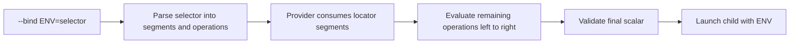

## Goal Capsule

- **Objective:** Replace the separate decoding flags with ordered, selector-local Base64 and JSON transforms.
- **Authority:** User-directed selector notation and current provider semantics take precedence over compatibility with the unpublished pre-release CLI.
- **Stop conditions:** Stop if a transform would change provider lookup arguments, expose a resolved secret in diagnostics, or make the transform grammar ambiguous.
- **Execution profile:** Contract change with parser, provider-boundary, documentation, plugin, and install-test verification.
- **Tail ownership:** The LFG pipeline owns simplification, review, commit, PR creation, and CI monitoring.

---

## Product Contract

### Summary

The right side of `--bind` becomes a complete description of how to obtain and transform one value.
Users express Base64 decoding and JSON traversal where they occur instead of repeating an environment-variable name in separate flags.

### Problem Frame

`--decode-source` and `--decode-value` describe implementation stages rather than the secret's structure.
They are hard to read, require the user to repeat an environment-variable name, and do not scale naturally to nested encoded JSON values.

### Requirements

- R1. A selector supports ordered annotations on a segment: `[base64]` decodes text and `[json]` parses text as JSON.
- R2. A selector applies its operations from left to right, then permits the next dot segment only when the current value is JSON data.
- R3. A bind still has the form `ENV_NAME=SELECTOR`; only the selector describes retrieval and transformation.
- R4. Provider locators, optional fields, scopes, provider commands, and provider-authentication scrubbing keep their current behavior.
- R5. The CLI no longer accepts `--decode-source` or `--decode-value`.
- R6. The final resolved value remains a string, number, or boolean before the target process starts.
- R7. Help text, README, skill, provider recipes, and generated plugin skill teach the same notation and explain operation order.
- R8. Diagnostics may identify provider, selector, scopes, and operation order but never resolved values or provider credentials.
- R9. An annotation is valid only on the segment that yields the retrieved value or on a JSON property reached after `[json]`; an annotation before another required provider-locator segment is rejected before provider invocation.

### Acceptance Examples

- AE1. `portainer.password[base64]` decodes the final password text.
- AE2. `portainer.config[base64][json].api.key` decodes a Base64 JSON source, parses it, then selects `api.key`.
- AE3. `portainer.config[json].credentials.password[base64][json].key[base64]` parses a JSON config, decodes a nested JSON password, selects `key`, then decodes that key.
- AE4. `portainer.config.api` fails with a clear error because JSON traversal was attempted without `[json]`.
- AE5. A selector with malformed annotations, invalid Base64, invalid JSON, a missing JSON property, or a non-scalar final value fails before the target process starts.

### Scope Boundaries

- In scope: selector parsing, evaluation, provider-boundary adaptation, tests, help, README, canonical skill, recipes, generated plugin skill, and the candidate version.
- Out of scope: new secret providers, new encodings, automatic encoding detection, changes to provider CLI authentication, or conversion of the child environment to an allowlist.

---

## Planning Contract

### Key Technical Decisions

- KTD1. **Use selector-local, ordered transform annotations.** `(session-settled: user-approved — chosen over separate --decode-source and --decode-value flags: the secret structure belongs beside its selector.)` A segment may carry zero or more `[base64]` and `[json]` annotations.
- KTD2. **Make JSON traversal explicit.** `(session-settled: user-approved — chosen over implicit JSON parsing on every remaining dot segment: [json] makes type transitions and operation order readable.)` A dot segment reads a property only from an already parsed JSON object or array.
- KTD3. **Parse into a selector operation model.** Provider adapters consume only bare locator and field names. The evaluator applies annotations and JSON-property reads after provider retrieval.
- KTD4. **Reserve unescaped brackets for annotations and support escaped literal brackets.** `\\[` and `\\]` join the existing escapes for dot and backslash so provider names and JSON keys remain expressible.
- KTD5. **Allow repeated and mixed operations when runtime types permit them.** For example, `[json][base64]` is valid when JSON resolves to a Base64 string; object values cannot be Base64-decoded.
- KTD6. **Keep annotations outside provider lookup.** An annotation attaches only to the final provider-consumed value segment (including an implicit default field) or to a later JSON property. Earlier required locator segments reject annotations, so provider commands always receive the same bare arguments.

### High-Level Technical Design

The provider boundary is unchanged: adapters retrieve one source value and do not interpret transform annotations.
The evaluator owns `[base64]`, `[json]`, JSON-property reads, scalar normalization, and failure messages.

### Assumptions

- This is a pre-release interface. Removing the two prior decoding flags is preferable to retaining aliases that preserve an unclear model.
- The selector grammar remains dot-based and preserves existing provider-specific locator shapes.

### Risks and Mitigations

- **Public contract migration:** Existing candidate wrappers using the old flags will fail. Remove all old examples and reject those flags with the normal invalid-option path.
- **Provider boundary regression:** Annotation-bearing locator segments could be passed to a provider command. Add adapter-focused tests for default and optional value segments.
- **Ambiguous locator placement:** An annotation before a still-required provider locator segment could be interpreted differently by adapters. Reject it during selector/provider-boundary validation, before launching a provider command.
- **Type confusion:** Transform order can change a text value into JSON data or back into text. Require explicit `[json]`, apply operations left to right, and reject invalid type transitions.

---

## Implementation Units

### U1. Model selector operations

- **Goal:** Parse escaped selector segments and ordered annotations into a representation that preserves provider locator names and evaluation order.
- **Requirements:** R1, R2, R6, R8, R9.
- **Dependencies:** None.
- **Files:** `src/selector.mjs`, `tests/cli.test.mjs`.
- **Approach:** Replace the string-only selector and implicit JSON-path helper with a structured selector operation model. Keep strict Base64 and UTF-8 validation. Support escaped dot, backslash, opening bracket, and closing bracket. Reject empty, unknown, and unterminated annotations.
- **Execution note:** Characterize the current escape and scalar behavior before changing the parser, then prove the new ordered behavior with focused tests.
- **Patterns to follow:** `src/selector.mjs` validation errors and `tests/cli.test.mjs` table-free Node test style.
- **Test scenarios:**
  - Parse `item.field[base64][json].key[base64]` with operation order intact.
  - Resolve Base64 JSON followed by a JSON property and a final Base64 leaf.
  - Resolve JSON text followed by Base64 when the parsed JSON value is a Base64 string.
  - Reject malformed annotations, unsupported transforms, invalid escaping, traversal before `[json]`, invalid Base64, invalid JSON, missing properties, and non-scalar final values.
- **Verification:** The selector unit tests prove type transitions, annotation order, errors, and scalar normalization without any provider process.

### U2. Preserve provider retrieval and simplify CLI bindings

- **Goal:** Feed bare locator names to all providers, evaluate selector operations after retrieval, and remove the decoding flags from the CLI.
- **Requirements:** R3, R4, R5, R6, R8, R9.
- **Dependencies:** U1.
- **Files:** `src/cli.mjs`, `src/providers.mjs`, `tests/cli.test.mjs`.
- **Approach:** Adapt provider selector access and selection boundaries to the structured model. Carry annotations on the last provider-consumed segment into evaluation. Preserve default `password` handling and optional `value` segments. Remove decoding-option parsing and debug summaries for separate flags.
- **Execution note:** Add characterization coverage for all seven provider command shapes before altering their selector access.
- **Patterns to follow:** `selection()` and `selectorPart()` in `src/providers.mjs`; all-or-nothing retrieval in `run()`; existing provider-auth scrubbing test.
- **Test scenarios:**
  - Each provider receives the same bare locator/field or target command arguments as before when a selector has annotations on its value segment.
  - An annotation before a further required provider locator, such as `service[base64].account`, is rejected before the provider command runs.
  - Bitwarden and 1Password use their default `password` field for `ITEM[base64]`.
  - BWS and Infisical keep their optional `.value` behavior with annotations.
  - Old decoding flags are rejected as invalid options.
  - A resolution failure does not reach the child launch path, while provider authentication remains absent from the child environment.
  - Debug output identifies selector operation metadata but does not include a resolved value or provider credential.
- **Verification:** The full Node test suite preserves every provider command assertion and proves the new bind contract.

### U3. Publish one selector grammar

- **Goal:** Make the CLI, README, skill, recipes, and plugin distribution teach the same transform grammar.
- **Requirements:** R7, R8.
- **Dependencies:** U1, U2.
- **Files:** `README.md`, `skills/secret-wrapper/SKILL.md`, `skills/secret-wrapper/references/provider-recipes.md`, `plugins/secret-wrapper/skills/secret-wrapper/SKILL.md`, `plugins/secret-wrapper/skills/secret-wrapper/references/provider-recipes.md`, `package.json`, `.claude-plugin/marketplace.json`, `plugins/secret-wrapper/.claude-plugin/plugin.json`, `plugins/secret-wrapper/.codex-plugin/plugin.json`.
- **Approach:** Document the grammar, explicit JSON rule, left-to-right order, provider examples, shell quoting, escape syntax, and migration from the removed flags. Edit only the canonical skill files, then regenerate the plugin copies with the repository script. Bump the shared candidate version.
- **Patterns to follow:** Canonical-to-generated skill synchronization in `tests/scripts/sync-plugin-skill.mjs` and shared version validation in `tests/scripts/validate.mjs`.
- **Test scenarios:**
  - Skill synchronization produces no diff.
  - Distribution validation accepts matching plugin copies and versions.
  - Local skill discovery exposes the canonical `secret-wrapper` skill.
- **Verification:** Package, plugin, and skill validation pass with no stale decoding flag in tracked documentation.

---

## Verification Contract

| Gate | Evidence |
| --- | --- |
| Unit behavior | `npm test` proves parser, evaluator, provider, CLI, and child-environment behavior. |
| Distribution consistency | `npm run validate` confirms the generated skill and plugin version alignment. |
| Package contents | `npm run pack:check` verifies the publishable candidate contents. |
| Skill discovery | `npx --yes skills add . --list` exposes `secret-wrapper`. |
| Plugin installation | CI runs the Docker-based idempotent plugin-install test for Codex and Claude. |

## Definition of Done

- The CLI has no separate decoding flags.
- A selector expresses ordered Base64 and JSON transformations, including nested cases, without allowing annotations to alter provider lookup arguments.
- Every provider receives unannotated locator values and retains its current scope and authentication behavior.
- Documentation explains why order matters and shows the supported nested examples.
- Canonical and generated skills are synchronized.
- Local verification and the GitHub Actions workflow pass.
